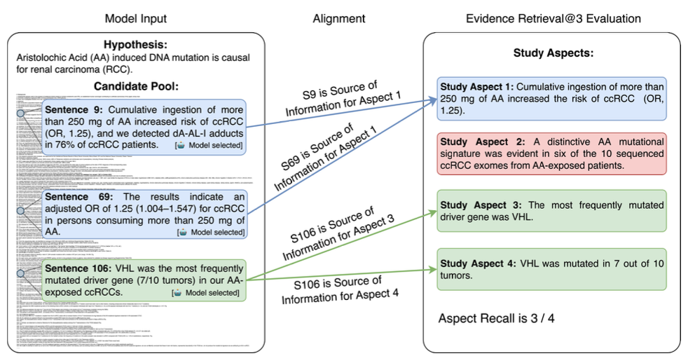

# Evidence Bench

  

## Introduction

Welcome to **EvidenceBench**! Our goal is to provide a robust benchmark for retrieving evidence from biomedical papers that provides evidence for or against scientific hypotheses. Our pipeline involves high-quality, sentence-by-sentence annotations, validated by human experts, across over 400 papers and 700k sentence judgments. 

Figure 1: In EvidenceBench, a model sees a hypothesis, and the full sequence of sentences from a paper as a candidate pool. The goal is to select sentences that provide evidence for or against the hypothesis. The retrieved sentences are compared to ground-truth study aspects, collected from literature surveys, which identify relevant evidence from the paper. In this case, the model selects S9, S69, and S106 as the set of retrieved sentences. However, these 3 sentences only cover study aspects 1, 3, and 4. Aspect 3 is missed, resulting in 75% Aspect Recall.

